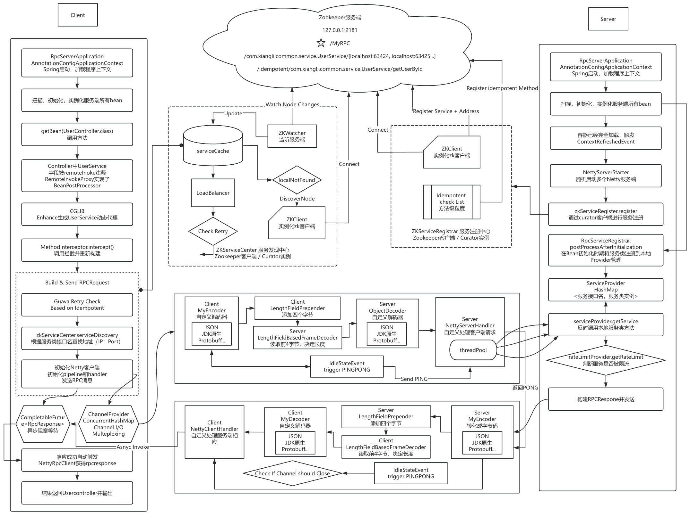

# Netty-Spring-ZK-RPC FrameWork


A lightweight RPC (Remote Procedure Call) framework built with **Netty**, **ZooKeeper**, and **Spring** for efficient service registration, discovery, and high-performance communication in high concurrency distributed systems.


## Table of Contents

- [Introduction](#introduction)
- [Project Features](#project-features)
- [RPC Overview](#rpc-overview)
- [Project Structure](#project-structure)
- [Running the Project](#running-the-project)
- [Main Implemented Features](#Main-plemented-Features)
  - [Custom Message Protocol and Codec](#custom-message-protocol-and-codec)
  - [Solving TCP Sticky Packet and Packet Fragmentation](#solving-tcp-sticky-packet-and-packet-fragmentation)
  - [Serialization Algorithms](#serialization-algorithms)
  - [Load Balancing Algorithms](#load-balancing-algorithms)
  - [Dynamic Proxy](#dynamic-proxy)
  - [Service Registration and Discovery](#service-registration-and-discovery)
  - [RPC Invocation Methods](#rpc-invocation-methods)
  - [Integration with Spring and Custom Annotations](#integration-with-spring-and-custom-annotations)
  - [Adding Netty Heartbeat Mechanism](#adding-netty-heartbeat-mechanism)
  - [Client Channel Multiplexing and Asynchronous Invocation](#client-channel-multiplexing-and-asynchronous-invocation)
  - [Server Fault Tolerance and Flow Control Degradation](#server-fault-tolerance-and-flow-control-degradation)
  - [Using Guava-Retry for Idempotent Services](#using-guava-retry-for-idempotent-services)
- [Flow Chart](#Flow-Chart)
- [Environment Setup](#environment-setup)
- [Project Testing](#project-testing)
- [Future Improvement](#Future-Improvement)


## Introduction

This **RPC** is a lightweight and efficient RPC framework designed to facilitate high-performance communication between distributed and high concurrency services written by Java. It leverages **Netty** for network communication, **ZooKeeper** for service registration and discovery, and **Spring** for seamless integration, dynamic proxy and ease of development.

The framework addresses common challenges in distributed systems such as service rigister & discovery, load balancing, serialization, encoding/decoding, network communication efficiency, I/O Multiplexing and Asynchronous Invocation.


## Project Features

- **High-Performance Network Communication with Netty**

  基于 Netty 高性能网络通信

- **Custom Message Protocol Structure, Encoder/Decoder, and Serializer to tolves TCP sticky packet and packet fragmentation issues**
  
  自定义消息编码/解码器和序列化器，解决TCP粘包拆包问题
  
- **Multiple Serialization Algorithms(JDK, JSON, Protostuff...)**
  
  实现多种序列化算法（JDK、JSON、PROTOSTUFF）
  
- **Service Registration and Discovery with ZooKeeper**

  基于 Zookeeper 实现服务注册与发现

- **Client-Side Service Local Cache and Dynamic Updates**

  客户端本地实现服务本地缓存监听与动态更新

- **Spring Integrated, Implements both JDK and CGLIB dynamic proxies, do service invocation based on custom annotations**
  
  集成 Spring 实现JDK和CGLIB动态代理，实现基于自定义注解的服务调用
  
- **Load Balancing Algorithms(Round-Robin, Random, Consistent Hashing)**
  
  为客户端提供三种负载均衡算法（轮询、随机、一致性哈希）
  
- **Based on Guava-Retry framework implements Timeout Retry Mechanism for Idempotent Services**
  
  使用Guava-Retry框架对白名单幂等性服务提供超时重试机制
  
- **Long Connection and Heartbeat Detection Mechanisms**

  解决短连接问题，实现长连接与心跳检测机制

- **Client Channel Multiplexing and Asynchronous Invocation**, **Server-Side Thread Pool for Improved Concurrency**

  客户端实现Channel多路复用和异步调用机制，服务端设置线程池提高并发性能

- **Server Fault Tolerance and Flow Control Degradation based on Bucket Tocken Alogorithm**

  服务端基于桶令牌算法实现故障/限流降级


## RPC Overview

RPC (Remote Procedure Call) allows a program to execute code on a remote system as if it were a local call, abstracting the complexity of network communication. In distributed systems, RPC frameworks are essential for enabling microservices to communicate efficiently.

A typical RPC framework involves:

1. **Service Registration**: The server registers its services with a registry (e.g., ZooKeeper).
2. **Service Discovery**: The client discovers services from the registry.
3. **Proxy Invocation**: Clients invoke services via local proxies, which handle serialization and network communication.
4. **Network Communication**: The framework manages the encoding and transmission of messages over the network.
5. **Response Handling**: The server processes requests and returns responses to the client.


## Project Structure

```css
├── rpc-client/
│   ├── src/
│   └── pom.xml
├── rpc-server/
│   ├── src/
│   └── pom.xml
├── rpc-common/
│   ├── src/
│   └── pom.xml
└── pom.xml
```

- **rpc-client**: Manages client-side RPC calls, including service discovery, load balancing, and network communication.
- **rpc-server**: Handles incoming RPC requests, service registration, and execution of service methods.
- **rpc-common**: Contains shared utilities such as message definitions, serialization mechanisms, and custom protocols.


## Running the Project

1. **Install and Start ZooKeeper**

   - Ensure ZooKeeper is installed and running on your local machine or accessible server.

2. **Configure Application Properties**

   - Update the `application.yml` or `application.properties` files in both **consumer** and **provider** modules to point to your ZooKeeper instance.

     ``` yaml
     # For Consumer
     rpc:
       client:
         registry-addr: your-zookeeper-address:2181
     
     # For Provider
     rpc:
       server:
         registry-addr: your-zookeeper-address:2181
     ```
   
3. **Start the Server**

   - Run the `NettyServerApplication` class to start the service provider.

4. **Start the Consumer**

   - Run the `NettyClientApplication` class to start the service consumer.

   


## Main Implemented Features

### Custom Message Protocol and Codec

**Overview**

In order to efficiently transmit data between client and server, -RPC defines a custom message protocol and implements corresponding encoders and decoders.

**Message Protocol Structure**

```scss
+---------------------+----------------+------------------+------------------+
| Serialization Type  | Message Type   | Data Length      | Request ID       |
| (1 byte)            | (1 byte)       | (4 bytes)        | (8 bytes)        |
+---------------------+----------------+------------------+------------------+
| Data Content (Variable Length)                                             |
+----------------------------------------------------------------------------+

```

- **Serialization Type**: Specifies the serialization algorithm used (e.g., JSON, Protostuff).
- **Message Type**: Indicates the type of message (e.g., request, response, heartbeat).
- **Request ID**: Unique identifier for the request, used to correlate responses.
- **Data Length**: Length of the data content.
- **Data Content**: The serialized data payload.

**Codec Implementation**

- **Encoder and Decoder**: Custom implementations extend Netty's `MessageToByteEncoder` and `ByteToMessageDecoder` to handle the encoding and decoding processes.

- **Serialization**: The framework supports multiple serialization algorithms, allowing flexibility in how objects are converted to bytes.

  

### Solving TCP Sticky Packet and Packet Fragmentation

**Problem**

- **Sticky Packet**: Multiple small packets are combined into one larger packet, causing the receiver to read multiple messages at once.
- **Packet Fragmentation**: A large packet is split into smaller packets, causing the receiver to read incomplete messages.

**Solution**

- **Length-Field Based Framing**: Use Netty's `LengthFieldBasedFrameDecoder` to handle packet boundaries based on the length field in the message protocol.

- **Implementation**

  ```java
  new LengthFieldBasedFrameDecoder(
      maxFrameLength, lengthFieldOffset, lengthFieldLength, lengthAdjustment, initialBytesToStrip);
  ```
  
- **Benefits**: Ensures that messages are correctly framed, preventing data corruption and synchronization issues.


### Serialization Algorithms

**Supported Algorithms**

- **JDK Serialization**
- **JSON Serialization**
- **Protostuff Serialization**

**Comparison**

| Serialization Algorithm  | Advantages                           | Disadvantages                    |
| ------------------------ | ------------------------------------ | -------------------------------- |
| JDK Serialization        | Easy to use, built-in                | Slow performance, large payloads |
| JSON Serialization       | Human-readable, language-independent | Larger size, slower than binary  |
| Protostuff Serialization | High performance, small payloads     | Requires schema, less flexible   |

**Implementation**

- **Extensibility**: The framework allows adding new serialization algorithms by implementing a common interface.
- **Selection**: Serialization type can be specified in the message header, enabling dynamic selection.


### Load Balancing Algorithms

**Implemented Algorithms**

1. **Round-Robin**
   - Cyclically selects the next available service instance.
2. **Random**
   - Randomly selects a service instance from the available pool.
3. **Consistent Hashing**
   - Ensures that the same request is routed to the same server, useful for stateful services.

**Usage**

- **Client-Side Load Balancing**: Clients use these algorithms to select a service instance when multiple instances are available.
- **Configuration**: The load balancing strategy can be configured based on the application's needs.


### Dynamic Proxy

**Purpose**

- Allows clients to invoke remote services as if they were local method calls.
- Hides the complexity of network communication and serialization.

**Implemented Proxies**

- **JDK Dynamic Proxy**
  - Requires the service interface to be defined.
  - Uses reflection and `InvocationHandler`.
- **CGLIB Proxy**
  - Can proxy classes without interfaces.
  - Generates subclasses at runtime.

**Integration with Spring**

- **Custom Annotations**: Use `@RemoteInvoke` to mark fields for injection with proxy instances.
- **Bean Post-Processing**: Spring's `BeanPostProcessor` is used to replace annotated fields with proxy instances.


### Service Registration and Discovery

**Registration**

- **Server-Side**
  - Services register themselves with ZooKeeper upon startup.
  - Metadata includes service name, address, and available methods.
- **Idempotent Methods**
  - Services can mark methods with `@Idempotent`.
  - Useful for enabling retry mechanisms.

**Discovery**

- **Client-Side**
  - Clients query ZooKeeper to discover available service instances.
  - Implemented caching to reduce ZooKeeper load.
- **Local Cache and Listening**
  - Clients maintain a local cache of services.
  - ZooKeeper watchers update the cache upon changes.


### RPC Invocation Methods

**Synchronous Invocation**

- Clients block until the server responds or a timeout occurs.
- Simple to implement and understand.

**Asynchronous Invocation**

- Clients send requests without blocking.
- Responses are handled via callbacks or futures.

**Implementation in -RPC**

- **Asynchronous Invocation with Futures**
  - Uses `CompletableFuture` to manage asynchronous responses.
  - Clients can choose to wait for the result or process it when available.


### Integration with Spring and Custom Annotations

**Annotations**

- `@RemoteInvoke`: Marks fields for injection with RPC proxies.
- `@Remote`: Marks for injection of service proxies
- `@Idempotent`: Marks methods that are idempotent and can be safely retried.

**Bean Post-Processing**

- **Client-Side**
  - `RemoteInvokeProxy` implements `BeanPostProcessor` to replace annotated fields with proxy instances.
- **Server-Side**
  - Services are registered upon initialization.
  - Methods annotated with `@Idempotent` are registered for idempotency checks.


### Adding Netty Heartbeat Mechanism

**Purpose**

- Maintains long-lived connections between clients and servers.
- Detects and handles inactive connections.

**Implementation**

- **Idle State Handling**
  - Uses Netty's `IdleStateHandler` to detect idle connections.
  - Configured to trigger events upon read/write inactivity.
- **Heartbeat Messages**
  - Clients send "PING" messages when idle.
  - Servers respond with "PONG" to keep the connection alive.

**Benefits**

- **Connection Stability**
  - Prevents connections from being closed due to inactivity.
  - Reduces overhead of establishing new connections.


### Client Channel Multiplexing and Asynchronous Invocation

**Channel Multiplexing**

- **Channel Reuse**
  - Clients maintain persistent connections to servers.
  - Channels are stored and reused for multiple requests.
- **Channel Management**
  - `ChannelProvider` class manages active channels.
  - Ensures that only active channels are used.

**Asynchronous Invocation**

- **Non-Blocking Calls**
  - Clients can send requests without waiting for immediate responses.
  - Responses are handled asynchronously via futures.
- **Unprocessed Requests**
  - `UnprocessedRequests` class tracks pending requests.
  - Responses are matched with requests using unique IDs.

**Benefits**

- **Performance Improvement**
  - Reduces latency by eliminating connection setup time.
  - Increases throughput by handling multiple requests over the same channel.


### Server Fault Tolerance and Flow Control Degradation

**Fault Tolerance**

- **Exception Handling**
  - Servers handle exceptions gracefully.
  - Clients receive meaningful error messages.
- **Retries**
  - Clients can retry failed requests for idempotent methods.

**Flow Control Degradation**

- **Thread Pool Management**
  - Servers use thread pools to handle incoming requests.
  - Prevents server overload by limiting concurrent processing.
- **Load Shedding**
  - Servers can reject requests when under heavy load.
  - Helps maintain overall system stability.


### Using Guava-Retry for Idempotent Services

**Purpose**

- Provides a mechanism to automatically retry failed requests for idempotent methods.

**Implementation**

- **Guava-Retry Integration**
  - Uses the Guava Retryer to handle retries with configurable policies.
- **Idempotency Checks**
  - Services mark methods with `@Idempotent`.
  - Clients check for idempotency before retrying.

**Benefits**

- **Improved Reliability**
  - Handles transient failures without burdening the client code.
  - Retries are only performed on methods that are safe to repeat.


## Environment Setup

- **Operating System**: Windows or Linux
- **JDK Version**: 1.8 or higher
- **Build Tool**: Maven 3.6 or higher
- **Integrated Development Environment**: IntelliJ IDEA or Eclipse
- **ZooKeeper**: Version 3.7.1 or compatible
- **Dependencies**:
  - **Netty**: 4.1.x
  - **Spring Boot**: 2.5.x
  - **Guava**: Latest stable release


## Flow Chart
（doc/img/1.0.0-process-chart.png)

 


## Project Testing

Haven't done smoke test or pressure test yet


## Future Improvement

- Spring - > Spring Boot
- Pressure Test
- Integrate Nacos
- Circuitbreaker