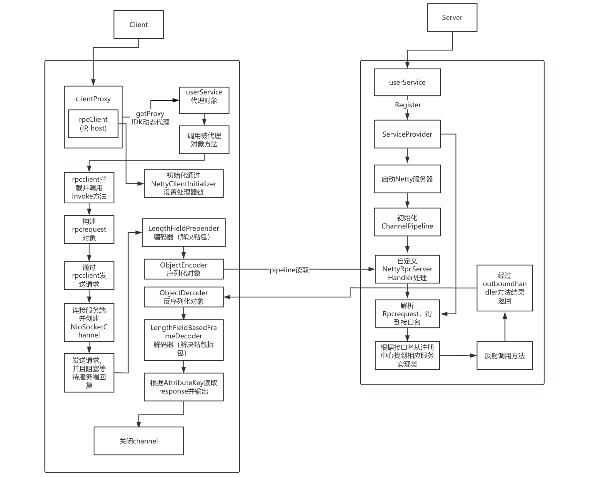

# 0.0.2 - JDK Dynamic Proxy + Netty RPC

## Objective:

This version extends the basic RPC framework using JDK Dynamic Proxy combined with Netty for asynchronous communication. The goal is to enhance the performance and scalability of the basic RPC implementation by leveraging Netty's powerful event-driven, non-blocking I/O model.

## Project Structure:

- `com.xiangli.client`
  - proxy
    - `IoCClient`: Handles communication with the server using sockets and sends/receives serialized `RpcRequest` and `RpcResponse` objects.
    - `ClientProxy`: Acts as a dynamic proxy to intercept method calls, convert them into RPC requests, and send them to the server through Netty.
  - netty
    - handler
      - `NettyClientHandler`: Handles the processing of responses from the server once the request is sent.
    - initializer
      - `NettyClientInitializer`: Sets up the channel pipeline, adding the encoders and decoders required for the RPC communication.
  - **`TestClient`**: Provides test cases to demonstrate how the client communicates with the server using Netty.
- `com.xiangli.common`
  - message
    - `RpcRequest`: Represents the request object sent from the client to the server.
    - `RpcResponse`: Represents the response object returned by the server to the client.
  - pojo
    - `User`: A simple user entity class used to demonstrate RPC operations.
  - service
    - `UserService`: Defines the interface for user-related operations.
    - `UserServiceImpl`: Implements `UserService`, providing the actual business logic.
- `com.xiangli.server`
  - handler
    - `NettyRpcServerHandler`: The core server handler that receives requests, processes them, and returns responses to the client.
  - initializer
    - `NettyServerInitializer`: Configures the server pipeline, adding handlers for decoding, processing, and encoding.
  - provider
    - `ServiceProvider`: Manages service registration and discovery, allowing the server to locate the correct service implementation for each request.
  - server
    - `SimpleRpcServer`: Implements the core logic for the RPC server, handling incoming connections and dispatching requests.
    - `ThreadPoolRpcServer`: A thread-pool version of the server that handles multiple client connections concurrently using a thread pool.

## Workflow Overview:

The process is divided into two parts: the client-side and the server-side. Here's a detailed breakdown of the flow:

### Client Side:

1. **Dynamic Proxy Creation**:
   - A client creates a proxy object for the service interface (`UserService`) using the `ClientProxy` class. This proxy object will intercept method calls made on the `UserService` interface.
2. **Intercept Method Call**:
   - When a method is called on the `proxy`, the `ClientProxy` intercepts it, creating an `RpcRequest` object containing the method name, parameters, and the interface name.
3. **Netty Pipeline Setup**:
   - The `NettyClientInitializer` sets up the Netty pipeline, adding handlers to encode/decode the RPC request and response objects.
4. **Send Request**:
   - The `RpcRequest` is sent to the server through the Netty channel. The client waits for the `RpcResponse` to be returned and stored in the channel's attributes.
5. **Receive Response**:
   - The `NettyClientHandler` receives the `RpcResponse` from the server, stores it in the channel's attributes, and the channel is then closed.
6. **Return Data**:
   - The `ClientProxy` retrieves the response from the channel and returns the result back to the client.

### Server Side:

1. **Service Registration**:
   - The server registers the implementation of the `UserService` in the `ServiceProvider` class, making it available for remote calls.
2. **Netty Server Setup**:
   - The `NettyServerInitializer` configures the server pipeline, adding handlers to decode the incoming request, invoke the appropriate service method, and encode the result.
3. **Receive Request**:
   - When the client sends a request, the `NettyRpcServerHandler` decodes the `RpcRequest` and uses reflection to find and invoke the correct method from the `UserServiceImpl`.
4. **Return Response**:
   - After invoking the method, the result is packed into an `RpcResponse` object, which is then sent back to the client through the Netty pipeline.

## Example Flow Diagram:

