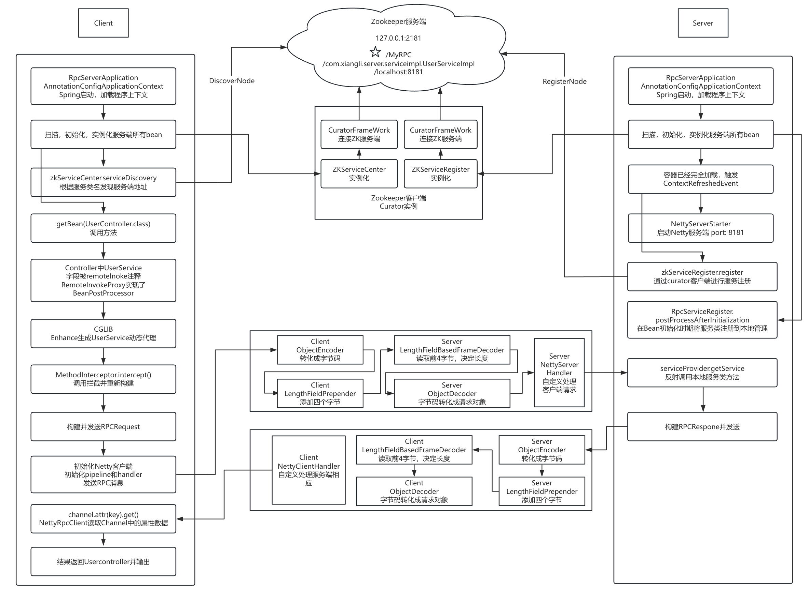

## Spring + Netty RPC (Version 0.2.1)

### **Overview**

Version 0.2.1 enhances the Spring + Netty RPC framework by improving the service discovery mechanism with ZooKeeper and providing a more detailed process for dynamic proxy creation on the client-side. This version builds on the modularization introduced in version 0.1.2 and further solidifies the client-server interaction workflow using Spring, Netty, and ZooKeeper.

### **Key Features**

- **Service Discovery with ZooKeeper**: The framework now supports automatic service discovery via ZooKeeper, enabling more dynamic and scalable client-server communication.
- **Dynamic Proxies for RPC Calls**: Clients can invoke remote methods using dynamic proxy generation with CGLIB, allowing for seamless remote method invocation.
- **Netty-Based Communication**: Netty handles all network communication between the client and server, ensuring efficient, asynchronous communication.
- **Spring Dependency Injection**: Both client and server modules leverage Spring for easy configuration and management of service beans.
- **Log4j Logging**: Detailed logging throughout the client, server, and ZooKeeper registration process for easier debugging and monitoring.

### **Project Structure**

1. **Modules**:
   - **rpc-client**: Contains all client-side logic, including the dynamic proxy implementation (`RemoteInvokeProxy`) and the Netty client (`NettyRpcClient`).
   - **rpc-server**: Handles server-side logic, including Netty server initialization (`NettyRpcServer`) and service registration (`ServiceProvider`, `RpcServiceRegistrar`).
   - **rpc-common**: Contains shared components like the RPC request/response models (`RpcRequest`, `RpcResponse`) and common service interfaces (`UserService`).
2. **Key Classes**:
   - **NettyRpcClient**: Manages RPC request sending and response handling from the server.
   - **NettyRpcServer**: Initializes the server and handles incoming client requests, invoking the appropriate service methods.
   - **RemoteInvokeProxy**: Dynamically creates proxies for client-side service interfaces, forwarding method calls to the server via RPC.
   - **RpcRequest & RpcResponse**: Define the structure of the communication between client and server, including method names, parameters, and return values.
   - **ZKServiceRegister & ZKServiceCenter**: Handles service registration and discovery with ZooKeeper.

### **Improvements Over Version 0.1.2**

- **ZooKeeper Integration**: Automatic service discovery and registration using ZooKeeper ensures scalability and fault tolerance.
- **Detailed Dynamic Proxy Creation**: Enhanced process for creating client-side service proxies using CGLIB, allowing transparent remote service invocation.
- **Simplified Service Registration**: Automatic registration of services marked with the `@Remote` annotation in the Spring container.

### **Workflow Overview**

- Service Registration (Server-Side):
  - Services annotated with `@Remote` are automatically registered by the `RpcServiceRegistrar` to the `ServiceProvider`.
  - The `ZKServiceRegister` registers the service with ZooKeeper, making it discoverable by clients.
  - The `NettyRpcServer` listens on a specified port (e.g., 8181) for incoming client requests.
- Service Discovery and Invocation (Client-Side):
  - The client discovers services using `ZKServiceCenter`, which retrieves the service's location from ZooKeeper.
  - `RemoteInvokeProxy` generates a proxy for the service interface using CGLIB, intercepts method calls, and forwards them as `RpcRequest` messages to the server.
  - The `NettyRpcClient` sends the request to the server and waits for a `RpcResponse`, which is returned to the calling method.

### **Running the Project**

1. Server:
   - Start the server by initializing the Spring container. This will automatically register services with ZooKeeper and start the Netty server to handle incoming client requests.
2. Client:
   - The client application initializes its Spring container, which retrieves service information from ZooKeeper. The client can then invoke remote methods via dynamically generated proxies.

### Flow Chart

