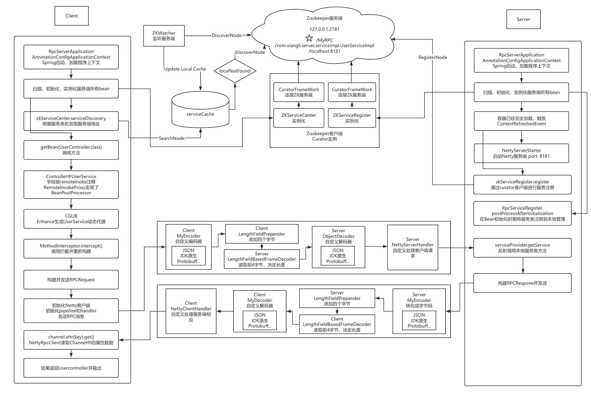

# Spring + Netty + ZK + RPC with Local Cache (Version 0.2.3)

### **Overview**

Version 0.2.3 introduces the integration of a local cache system combined with Zookeeper-based service discovery. This update enhances the Spring + Netty + Zookeeper (ZK) RPC framework by incorporating a local cache to store service addresses, reducing ZK lookups and improving response time. The local cache is automatically synchronized with Zookeeper using a `ZKWatcher`, which ensures that any service registration, update, or removal in Zookeeper is dynamically reflected in the cache.

### **Key Features**

- **Local Cache for Service Discovery**: The framework now includes a local cache (`serviceCache`) for storing service addresses, improving performance by reducing the need for repeated service lookups in Zookeeper.
- **Zookeeper Dynamic Watcher**: The `ZKWatcher` is integrated to monitor changes in Zookeeper and keep the local cache up to date. When services are registered, updated, or removed, these changes are automatically reflected in the local cache.
- **Enhanced Service Discovery**: Service discovery now checks the local cache first for service addresses, falling back to Zookeeper if the service is not found locally. This provides a faster and more efficient discovery mechanism.
- **Spring Integration**: The framework continues to leverage Spring for managing dependencies and RPC service registration, allowing seamless configuration and integration with Spring-based applications.
- **Netty for Network Communication**: Netty remains the core component for efficient and scalable network communication, handling all client-server interactions with custom encoding and decoding mechanisms.

### **Project Structure**

1. **Modules**:
   - **rpc-client**: Contains client-side logic, including service discovery using both local cache and Zookeeper, dynamic proxy generation (`RemoteInvokeProxy`), and the Netty client (`NettyRpcClient`). The client first checks the local cache for service addresses and uses Zookeeper only as a fallback.
   - **rpc-server**: Manages server-side logic, including service registration to Zookeeper (`ZKServiceRegister`) and the Netty server (`NettyRpcServer`), which handles requests from clients and responds based on the requested method.
   - **rpc-common**: Provides common components such as the RPC request/response models (`RpcRequest`, `RpcResponse`), and custom serialization logic.
2. **Key Classes**:
   - **serviceCache**: A local cache system implemented as a map, storing service names and their corresponding addresses. The cache is dynamically updated based on changes detected by the `ZKWatcher`.
   - **ZKWatcher**: A Zookeeper-based watcher that listens for changes in service nodes (e.g., service registration, updates, or deletions) and updates the local cache accordingly. This ensures that the local cache is always synchronized with Zookeeper.
   - **NettyRpcClient**: Manages the sending of RPC requests to the server and receiving of responses, using the cached service addresses whenever possible.
   - **NettyRpcServer**: Handles incoming requests from clients and responds with the results of the invoked services.
   - **RpcRequest & RpcResponse**: Define the structure of the communication between client and server, encapsulating method names, parameters, and return values.

### **Improvements Over Version 0.2.2**

- **Local Cache for Faster Discovery**: The introduction of a local cache drastically improves the performance of service discovery by reducing dependency on Zookeeper for every lookup.
- **ZK Watcher for Dynamic Updates**: The local cache is synchronized with Zookeeper in real-time using the `ZKWatcher`. Any changes in service nodes, such as additions, updates, or removals, are immediately reflected in the local cache.
- **Robust Error Handling**: Improved error handling ensures that issues with service discovery, such as missing services or network failures, are gracefully managed, and fallback strategies are in place.
- **Optimized Performance**: By reducing network overhead through local cache lookups and only accessing Zookeeper when necessary, the overall performance of the RPC framework is enhanced.

### **Workflow Overview**

- **Service Registration (Server-Side)**:
  - Services annotated with `@Remote` are automatically registered in the Spring container. The `ZKServiceRegister` registers these services with Zookeeper, making them discoverable by clients.
  - The `NettyRpcServer` listens for client requests and responds with the results of the invoked service methods.
- **Service Discovery and Invocation (Client-Side)**:
  - When a method is invoked on a client-side proxy, the framework first checks the local cache for the requested service's address.
  - If the service is found in the cache, the address is used to send an RPC request. If not, the client uses `ZKServiceCenter` to retrieve the service address from Zookeeper.
  - `ZKWatcher` ensures that the local cache is kept in sync with Zookeeper, automatically updating the cache when services are registered, updated, or removed.

### **Flowchart**
