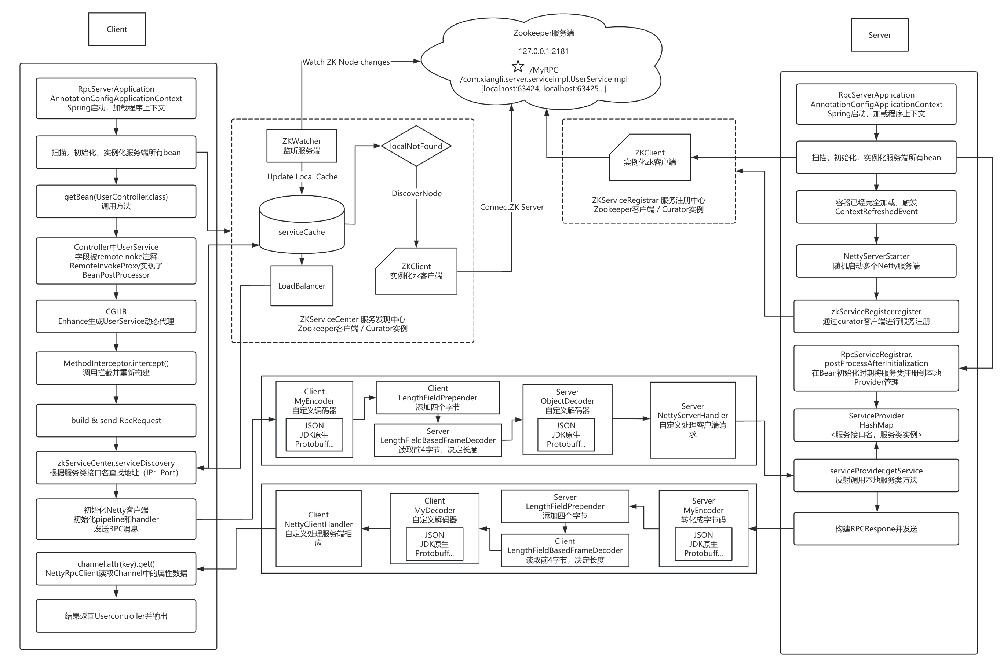

# Spring + Netty + Zookeeper + RPC with Local Cache (Version 0.2.4)

### **Overview**

Version 0.2.4 builds upon the previous version (0.2.3) by introducing enhanced load balancing, optimized service discovery, and improved overall performance. This update integrates a consistent hash-based load balancing mechanism and further optimizes the interaction between local caching and Zookeeper-based service discovery. The focus is on ensuring efficient service routing, minimizing latency, and maintaining synchronization with dynamic service registries.

### **Key Features**

- **Consistent Hash-Based Load Balancing**: The framework now includes a consistent hash load balancing algorithm, ensuring an even distribution of requests across available service instances. This feature enhances fault tolerance and request handling efficiency, particularly in distributed environments.
- **Dynamic Local Cache Updates**: The local cache (`serviceCache`) continues to store service addresses for faster lookups. This version optimizes cache updates by refining the synchronization with Zookeeper through the `ZKWatcher`, reducing potential inconsistencies and improving service availability.
- **Service Registration and Discovery**: Service discovery prioritizes cached addresses, minimizing calls to Zookeeper unless the service is unavailable locally. The `ZKServiceCenter` works in tandem with `ZKWatcher` to ensure real-time synchronization.
- **Spring and Netty Integration**: Spring remains integral for dependency management and service registration, while Netty efficiently handles client-server communication, employing custom encoders and decoders for RPC data transmission.

### **Project Structure**

1. **Modules**:
   - **rpc-client**: Includes the client-side logic such as dynamic proxy generation (`RemoteInvokeProxy`), service discovery using both local cache and Zookeeper, and the newly implemented load balancing logic in `ConsistentHashBalance`.
   - **rpc-server**: Handles server-side logic, including the registration of services in Zookeeper (`ZKServiceRegister`) and managing client requests using `NettyRpcServer`.
   - **rpc-common**: Contains shared components, such as RPC request/response models (`RpcRequest`, `RpcResponse`), serialization strategies, and the load balancing algorithms.
2. **Key Classes**:
   - **ConsistentHashBalance**: Implements a consistent hash algorithm for distributing client requests evenly across multiple service instances. Virtual nodes are used to enhance fault tolerance and load distribution.
   - **serviceCache**: The local cache storing service names and corresponding addresses, updated dynamically by the `ZKWatcher`.
   - **ZKWatcher**: Watches for changes in Zookeeper and updates the local cache when services are registered, updated, or removed.
   - **NettyRpcClient**: Manages client requests, including service discovery, load balancing, and sending RPC calls using Netty.
   - **NettyRpcServer**: Handles incoming RPC requests and returns results based on the requested service method.

### **Improvements Over Version 0.2.3**

- **Consistent Hash Load Balancing**: The introduction of the consistent hash algorithm improves request distribution across multiple service instances and ensures efficient failover handling.
- **Optimized Cache Synchronization**: The local cache mechanism is now more responsive to service changes, ensuring minimal downtime during service updates or removals.
- **Enhanced Error Handling**: Improved strategies for managing network failures and missing services, with a robust fallback mechanism that ensures service continuity.

### **Workflow Overview**

- **Service Registration (Server-Side)**:
  - Services annotated with `@Remote` are registered in the Spring container and automatically added to Zookeeper by `ZKServiceRegister`. These services are then available for discovery by clients.
  - The `NettyRpcServer` listens for client requests and invokes the corresponding service methods, returning the result to the client.
- **Service Discovery and Invocation (Client-Side)**:
  - When a client invokes a service method via a proxy, it first checks the local cache for the service address.
  - If the service is cached, the address is used to initiate the RPC call. Otherwise, the client retrieves the address from Zookeeper through the `ZKServiceCenter`.
  - The `ConsistentHashBalance` algorithm ensures even load distribution, routing client requests to appropriate service instances based on consistent hashing.
  - The `ZKWatcher` ensures that the local cache remains in sync with Zookeeper, updating it dynamically as service nodes change.

### **Flowchart**

