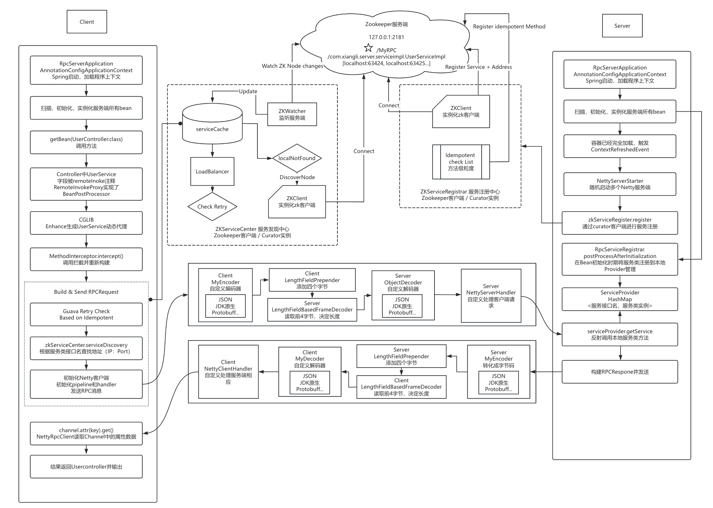

# Spring + Netty + Zookeeper + RPC with Guava Retry (Version 0.2.5)

## Overview

Version 0.2.5 builds upon the improvements of version 0.2.4 by adding **Guava Retryer** functionality alongside an **idempotence check** mechanism at the method level. This ensures that RPC calls are retried for certain service methods only if they are deemed idempotent. The retry logic operates on a per-method basis, giving granular control over which methods can be safely retried during failure scenarios. This version also retains previous optimizations in load balancing, service discovery, and local cache integration, making the framework more robust for distributed systems.

### Key Features

1. **Method-Level Idempotence Check**: Methods annotated with `@Idempotent` are checked during service registration. The framework allows only idempotent methods to be retried, reducing the risk of duplicating non-idempotent operations.
2. **Guava Retryer Integration**: Methods identified as idempotent are retried automatically using the **Guava Retryer** mechanism. The retry strategy is customizable, allowing the user to define how many attempts, the wait strategy, and stop criteria.
3. **White-List Based Retry Logic**: The framework introduces a white-list approach to idempotence at the method level. Only methods explicitly annotated as idempotent will undergo retry logic, thus enforcing strict control over which methods can be retried safely.
4. **Spring + Netty + Zookeeper Integration**: Spring is used for dependency management, while **Netty** handles efficient RPC communication between the client and server. Zookeeper is responsible for service registration and discovery, while the local cache reduces the load on Zookeeper by prioritizing cached addresses.

### Project Structure

**Modules**:

- `rpc-client`: Contains the client-side logic, such as dynamic proxy generation (`RemoteInvokeProxy`), service discovery, load balancing, and method-level idempotence checks.
- `rpc-server`: Manages server-side logic, including service registration (`ZKServiceRegister`) in Zookeeper, handling RPC requests, and the management of services with Netty.
- `rpc-common`: Holds shared components, such as request/response models (`RpcRequest`, `RpcResponse`), serialization strategies, and core utility classes like idempotence checks and retry logic.

**Key Classes**:

- **RemoteInvokeProxy**: A dynamic proxy class responsible for handling client RPC method invocations, including idempotence checks and retry handling for annotated methods.
- **ZKServiceRegister**: Registers services in Zookeeper and checks methods for idempotence during the registration process.
- **NettyRpcClient**: Manages the client’s interaction with the server, including service discovery, retries for idempotent methods, and sending requests using Netty.
- **Guava Retryer**: Provides retry logic for idempotent methods, ensuring that failed requests can be retried with a controlled strategy (e.g., fixed wait times or exponential backoff).
- **serviceCache**: Maintains a local cache of service addresses, enabling faster lookups and reducing the load on Zookeeper.

### Improvements Over Version 0.2.4

- **Guava Retry Mechanism**: Introduces an efficient and flexible retry mechanism, allowing for retries of RPC calls to be customized at a granular level (e.g., retries based on response status or network failures).
- **Method-Level Idempotence Check**: By introducing the `@Idempotent` annotation, the framework prevents retries for non-idempotent methods, reducing the risk of duplicate data updates or unwanted side effects in distributed transactions.
- **Enhanced Error Recovery**: With the addition of the Guava Retryer and idempotence checks, the framework becomes more resilient to network failures and intermittent errors, ensuring only safe methods are retried.

### Workflow Overview

#### Service Registration (Server-Side):

1. **Idempotence Check**: During service registration, the framework scans the service methods. Methods annotated with `@Idempotent` are marked for retry in case of failure.
2. **Service Registration**: Services annotated with `@Remote` are registered in Zookeeper by the `ZKServiceRegister`. Each service method's idempotence status is also recorded.
3. **Netty Server**: The `NettyRpcServer` listens for incoming RPC requests and invokes the corresponding service methods.

#### Service Discovery and Invocation (Client-Side):

1. **Local Cache Lookup**: When a client invokes a service method, the framework first checks the local cache for the service's address.
2. **Zookeeper Discovery**: If the service is not cached, the client retrieves the service address from Zookeeper via the `ZKServiceCenter`.
3. **Idempotence and Retry**: If the method is marked as idempotent, the Guava Retryer is used to retry the RPC call in case of failure, using a fixed wait strategy or another customizable retry strategy.
4. **Load Balancing**: The consistent hash load balancing algorithm ensures even distribution of requests to service instances.

### Key Changes in Version 0.2.5

- **White-List Retry Logic**: The retry logic is applied only to methods marked with `@Idempotent`, ensuring that the system only retries safe, idempotent methods.
- **Guava Retry Customization**: The retry mechanism is built with Guava Retryer, allowing configuration such as:
  - Retry if the response code indicates failure (e.g., code 500).
  - Stop after 3 attempts or when a valid response is received.
  - Retry with a fixed wait time of 2 seconds between attempts.
- **Method-Specific Idempotence**: Each method within a service is individually assessed for idempotence, offering finer control compared to service-level idempotence checks in previous versions.

### Project Flow

1. **Service Registration**: Services are registered with Zookeeper and idempotent methods are marked.
2. **Service Discovery**: Clients discover services using the local cache or Zookeeper if needed.
3. **Request Handling**: Requests are sent to the discovered service instance, with retries applied for idempotent methods.
4. **Response Management**: Responses are returned to the client, and retries are attempted if the method is idempotent and initial attempts fail.

### Flowchart

