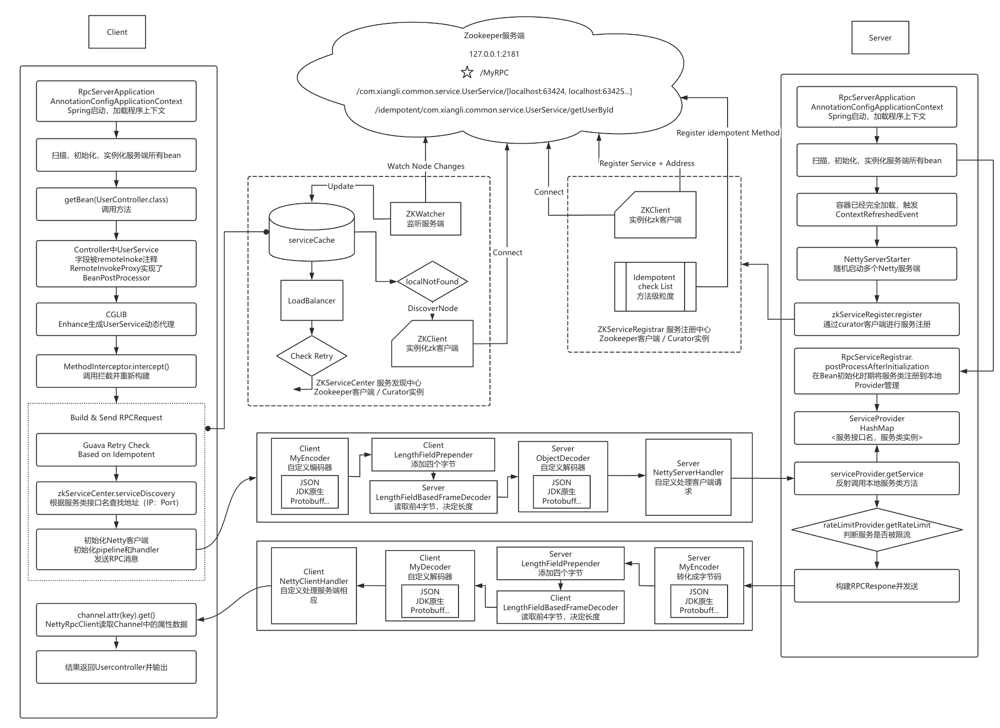

# Spring + Netty + Zookeeper + RPC with Token Bucket Rate Limiting (Version 0.2.6)

### Overview

Version 0.2.6 introduces a **Token Bucket-based Rate Limiting** mechanism on the server side, ensuring that service requests are controlled and rate-limited efficiently. This new feature applies rate-limiting policies based on service methods, allowing the system to restrict the frequency of incoming requests. While previous versions focused on retry mechanisms and idempotence checks, this release adds a **per-service rate limiting policy** that enhances control over traffic and server load.

This version continues the integration with Spring, Netty, and Zookeeper, offering robust service discovery and communication while improving performance with local caching and dynamic load balancing.

### Key Features

1. **Token Bucket Rate Limiting**: A token bucket algorithm is implemented on the server side, ensuring that each service has a specific rate limit to handle incoming requests. Tokens are generated at a fixed rate, and requests are processed only if sufficient tokens are available.
2. **Service-Level Rate Limiting**: Rate limiting is applied per service, meaning all instances of a service share the same token bucket. This allows for granular control over traffic, ensuring that a service doesn't get overwhelmed by too many requests.
3. **Dynamic Token Bucket Configuration**: The rate (tokens per second) and bucket size (maximum number of tokens) are configurable per service, allowing different services to have different limits based on their usage patterns and required throughput.
4. **Spring + Netty + Zookeeper Integration**: The framework continues to rely on Spring for dependency injection and Zookeeper for service registration and discovery. Netty is used for fast, non-blocking RPC communication.

### Project Structure

#### Modules:

- **rpc-client**: Handles the client-side logic, including service discovery, dynamic proxy generation, and retry logic for idempotent methods. The token bucket logic does not directly affect the client.
- **rpc-server**: Manages server-side functionality, including service registration, request handling, and now rate limiting for services.
- **rpc-common**: Contains shared components like request/response models, serialization, and utility classes (e.g., the rate limiter and idempotence check).

#### Key Classes:

- **`TokenBucketRateLimitImpl`**: Implements the token bucket rate-limiting algorithm, generating tokens at a specified rate and checking availability before processing a request.
- **`RateLimitProvider`**: Manages the creation and retrieval of rate limiters for each service. Each service gets a dedicated rate limiter with configurable token rates and capacities.
- **`ServiceProvider`**: Registers services with Zookeeper and ensures that rate limiting is applied before executing any service method.
- **`ZKServiceRegister`**: Handles service registration in Zookeeper, including service methods annotated as idempotent. Services are registered with their associated rate limiters.
- **`NettyRpcServer`**: Manages incoming RPC requests and checks rate limits before forwarding requests to the appropriate service method. If the rate limit is exceeded, the request is rejected with an error response.

### Improvements Over Version 0.2.5

- **Token Bucket Rate Limiting**: The key addition is the rate-limiting mechanism that controls the number of requests processed per service. This helps prevent service overloads and ensures that traffic remains within acceptable limits.
- **Service-Level Rate Control**: Rate limits are applied per service, not per instance or client. This ensures that requests from multiple clients are fairly distributed and managed, protecting critical services from being overwhelmed.
- **Configurable Rate and Capacity**: Each service can be assigned a different rate of token generation and bucket capacity, allowing the system to adapt to varying performance and traffic requirements.

### Workflow Overview

#### **Service Registration (Server-Side)**

1. **Rate Limiting Configuration**: During service registration, a token bucket rate limiter is created for each service. The rate and bucket size are configurable, and rate limiters are managed by the `RateLimitProvider`.
2. **Idempotence Check**: Methods annotated with `@Idempotent` are identified during the registration process. These methods can be safely retried using the Guava Retry mechanism if necessary.
3. **Service Registration**: Services are registered in Zookeeper, including idempotence checks and rate limiter initialization.
4. **Netty Server**: The `NettyRpcServer` listens for incoming requests and processes them through the rate limiter.

#### **Service Discovery and Invocation (Client-Side)**

1. **Service Lookup**: The client checks the local cache for service addresses. If not found, it uses Zookeeper for service discovery.
2. **RPC Call**: Once a service is found, the client sends an RPC request to the server, which first checks the rate limiter before invoking the service method.
3. **Rate Limiting Enforcement**: On the server, if the rate limiter permits the request (i.e., there are sufficient tokens), the request is processed. If the limit is reached, the request is rejected, and the client is notified.
4. **Load Balancing**: Requests are distributed evenly across service instances using the consistent hash load balancing mechanism, ensuring efficient use of server resources.

### Key Changes in Version 0.2.6

- **Token Bucket Rate Limiting**: Rate limiting is implemented on a per-service basis. Each service has its token bucket, and requests are processed only if enough tokens are available.
- **Service-Level Control**: Rate limits are applied globally for each service, regardless of the number of instances or clients.
- **Configurable Token Rates**: The rate limiter's token generation rate and bucket size are configurable, allowing different services to have different traffic capacities.

### Project Flow

1. **Service Registration**: Services are registered with Zookeeper, and token bucket rate limiters are initialized for each service.
2. **Service Discovery**: Clients discover services through the local cache or Zookeeper.
3. **Request Handling**: RPC requests are processed, with the rate limiter ensuring that only permitted requests are forwarded to the service methods.
4. **Rate Limiting and Response**: If the rate limit is exceeded, the request is rejected. Otherwise, the method is invoked, and the result is returned to the client.

### FlowChart

