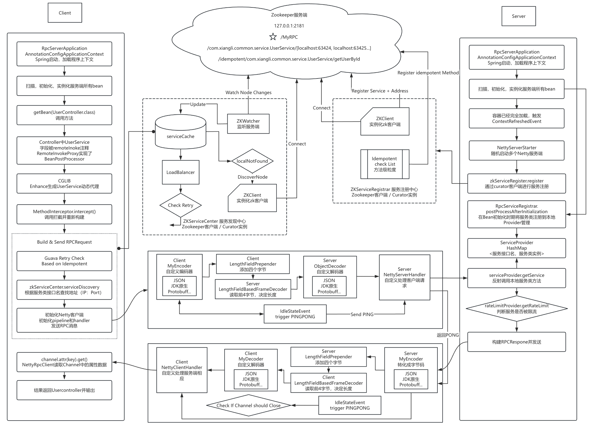

# **0.2.7 - HeartBeat for Longlink**

## **Overview**

Version 0.2.7 introduces a **heartbeat mechanism** to maintain long-lived connections between clients and servers in an RPC framework using **Spring**, **Netty**, and **Zookeeper**. This version ensures connection stability by periodically sending heartbeats ("PING" from the client and "PONG" from the server), preventing unnecessary disconnections during idle periods.

## **Key Features**

- **Heartbeat Mechanism**: Clients send regular "PING" messages to the server, which responds with "PONG" to keep the connection alive.
- **Connection Stability**: Ensures active connections during idle times, preventing premature disconnects.
- **Error Handling on Timeout**: Detects timeouts and triggers reconnections or error handling when no "PONG" is received.
- **Spring + Netty + Zookeeper Integration**: Seamless integration with the existing framework for high-performance, non-blocking communication.

## **Project Structure**

### **Modules**:

- **rpc-client**: Manages client-side heartbeats and service discovery.
- **rpc-server**: Handles heartbeat responses and manages RPC requests.
- **rpc-common**: Contains shared utilities like heartbeat logic and serialization.

### **Key Classes**:

1. **HeartbeatHandler**: Sends "PING" messages and handles "PONG" responses.
2. **NettyRpcClientHandler**: Manages heartbeat sending and RPC communication.
3. **NettyRpcServerHandler**: Responds to "PING" with "PONG" and processes RPC requests.

## **Workflow**

**Flow Chart**

1. **Service Registration**: Services are registered in Zookeeper.
2. **Client Sends Heartbeats**: Clients send "PING" messages during idle periods.
3. **Server Responds**: Server replies with "PONG" to maintain the connection.
4. **Timeout Handling**: If no "PONG" is received, the client may attempt to reconnect.

## **Conclusion**

Version 0.2.7 enhances connection reliability by introducing a heartbeat mechanism for long-running RPC connections, reducing downtime and improving system stability.